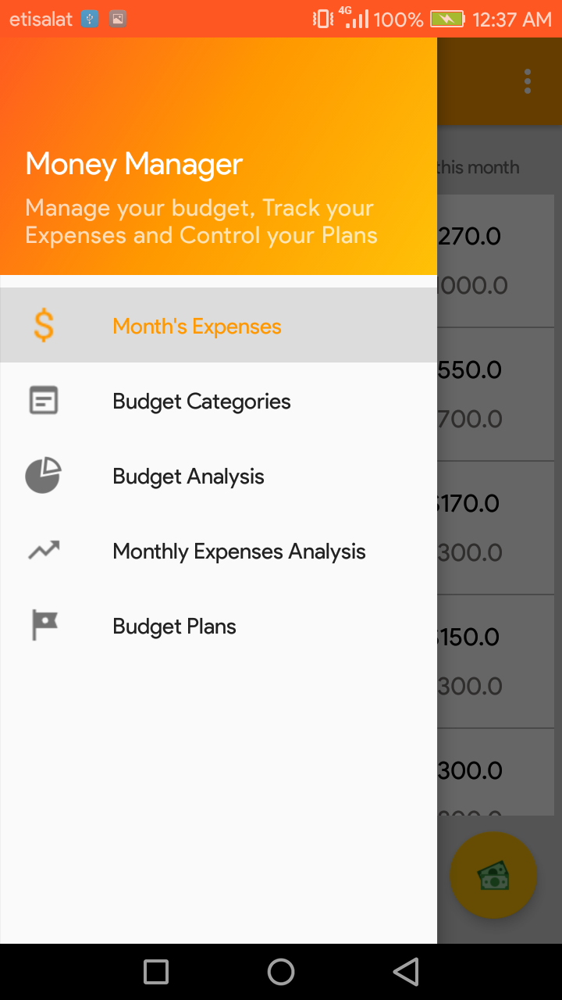
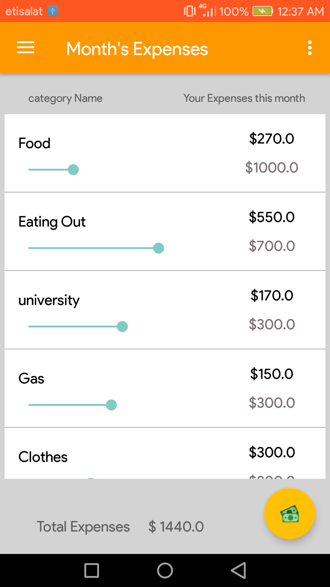
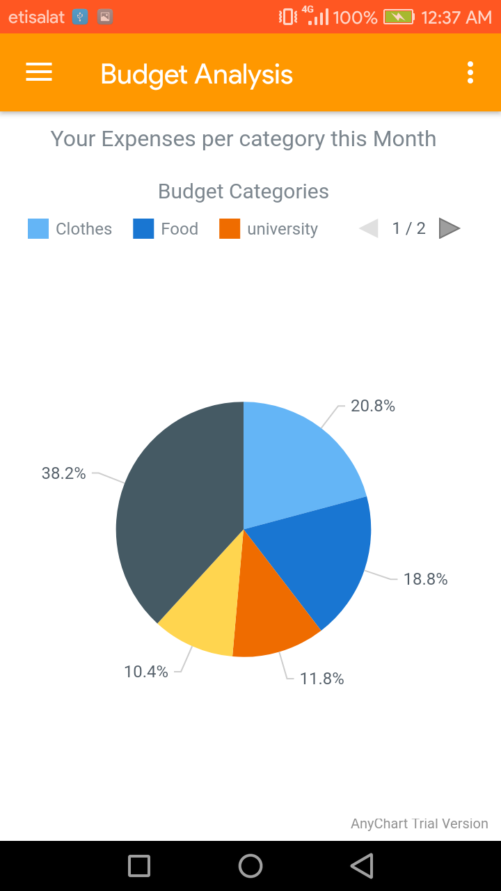
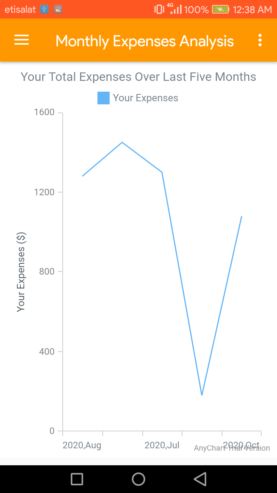

# Money-Manager-App
Java Android App that can help you manage your budget, track your expenses, and control your plans. 
This app also visualize your expenses over months and your expenses in each budget category you set to make it easy to track user's expenses.

## 📸 ScreenShots
<!--Check these screenshots [here](https://github.com/Nada-Nasser/Money-Manager-App/tree/main/screenshots) that contains an example of visualizing and tracking user expenses in the app.-->

 &nbsp &nbsp &nbsp &nbsp
  &nbsp &nbsp &nbsp &nbsp
  &nbsp &nbsp &nbsp &nbsp
        &nbsp &nbsp &nbsp &nbsp

## Installation
Clone this repository and import into Android Studio

